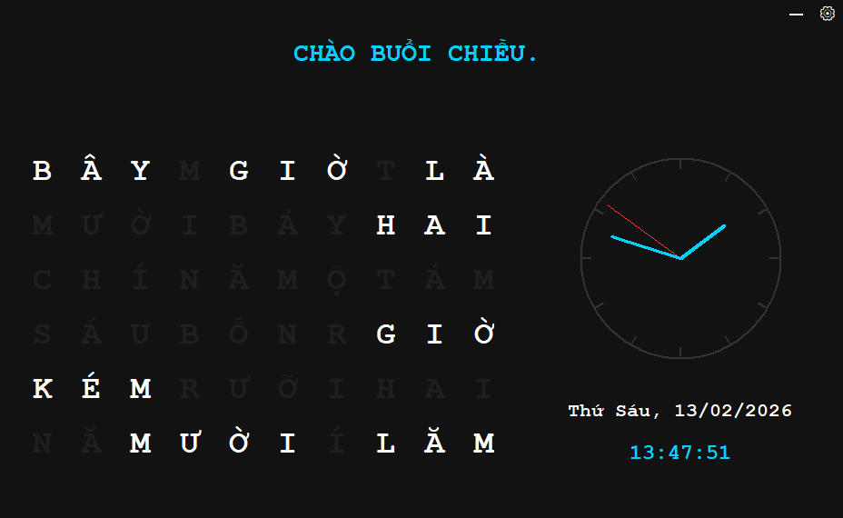
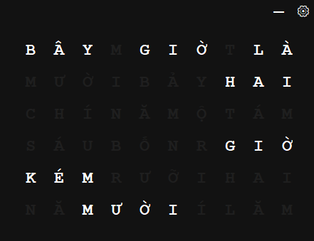

# Vietnamese Word Clock

A modern Vietnamese word-based clock inspired by QLOCKTWO.

Instead of showing digits, the clock displays the current time in Vietnamese words, lighting up the appropriate letters in a grid.

> The application interface is currently in Vietnamese.

---

## Features

- Vietnamese word time display rounded to five minutes
- Multiple color themes
- Analog clock
- Digital time and date display
- Test mode (auto time simulation)
- Manual time override
- Frameless draggable window
- Packaged as standalone Windows executable

---

## Preview






---

## Download

[Download the latest version](https://github.com/tridzfr/vietnamese-word-clock/releases/latest)

---

## Built With

- Python 3
- Tkinter
- PyInstaller (for packaging)

---

## Build From Source

Clone the repository:

```bash
git clone https://github.com/tridzfr/vietnamese-word-clock.git
cd vietnamese-word-clock
```

Build executable:

```bash
pyinstaller --onefile --windowed --icon=icon.ico clock.py
```

The executable will be created in:

```
dist/clock.exe
```

---

## Requirements

- Python 3.10+
- Tkinter (usually included with Python)
- PyInstaller (for building executable)
